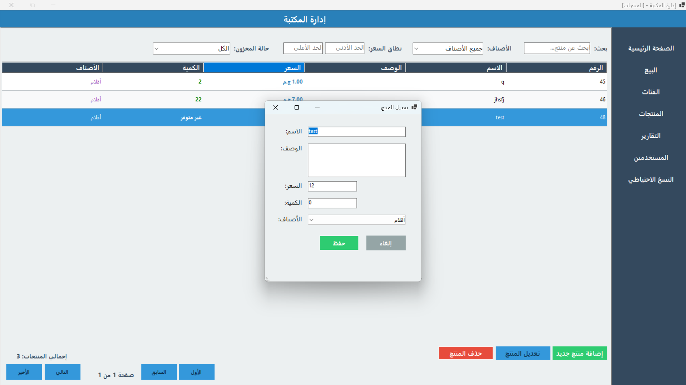

# Stationery Store Management System

A professional Windows Forms application designed for efficient management of a stationery store. The system supports inventory control, sales operations, user roles, and detailed reporting, all within a modern, fully localized right-to-left (Arabic) interface.

## Key Features

- **Secure Login & Roles**  
  Authentication system with role-based access for Admin and User accounts.

- **Product Management**  
  Add, update, delete, and search products with filtering by category and price.

- **Category Organization**  
  Manage product categories to streamline inventory navigation.

- **Sales & Invoicing**  
  Process sales through a cart system with real-time inventory updates and invoice generation.

- **Reports & Analytics**  
  Generate, view, and print detailed sales and revenue reports by custom date range.

- **User Administration**  
  Admins can manage user accounts, including creation and role assignment.

- **Dashboard Overview**  
  Interactive dashboard displaying product counts, stock levels, revenue, and sales performance.

- **Right-to-Left Interface**  
  Modern UI design fully tailored for Arabic users, offering a natural and intuitive experience.

## Login Screen

Below are screenshots of the login screen:


## Home Screen

Below is a screenshot of the home screen:


## Sell Screen

Below are screenshots of the sell screen:


## Category Screen

Below are screenshots of the category screen:


## Product Screen

Below are screenshots of the product screen:




## Reports Screen

Below are screenshots of the reports screen:


## Users Screen

Below is a screenshot of the users screen:


## Backup

Below is the backup icon used in the application:


## Technology Stack

- **.NET 8.0** – Windows Forms  
- **C#** – Application logic and structure  
- **Entity Framework Core** – ORM for SQL Server or SQLite  
- **Microsoft.Data.Sqlite** – Lightweight optional database support

## Project Structure

- `Entities/` – Core data models (User, Product, Category, Order, OrderItem)  
- `Forms/` – Application interface forms (Login, Home, Products, Sales, Reports, etc.)  
- `Data/` – Entity Framework DbContext and data operations  
- `Migrations/` – EF Core migration files  
- `Resources/` – Icons, images, and localization assets

## Getting Started

### Requirements

- Windows 10 or 11  
- [.NET 8.0 SDK](https://dotnet.microsoft.com/en-us/download/dotnet/8.0)  
- SQL Server (default) or SQLite

### Setup Instructions

1. **Clone the Repository**
   ```bash
   git clone <your-repo-url>

